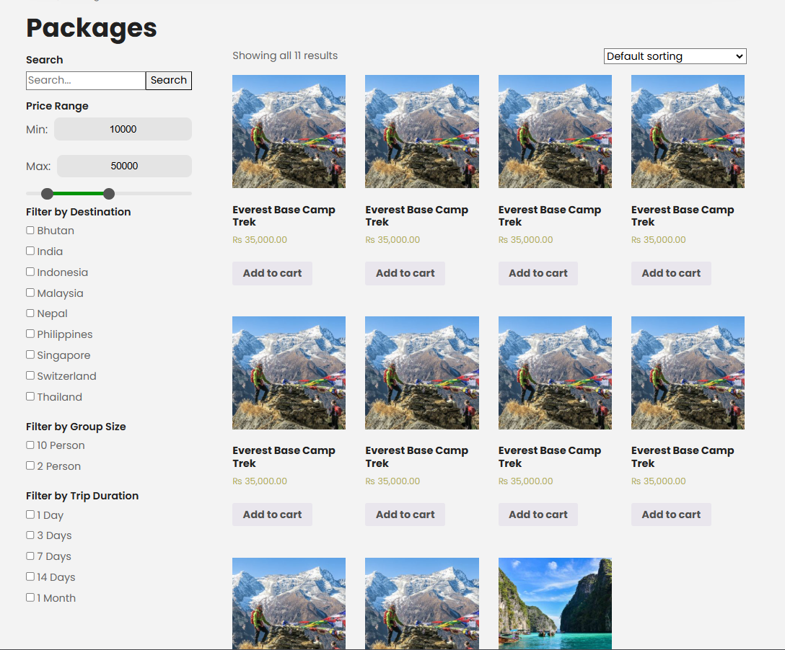
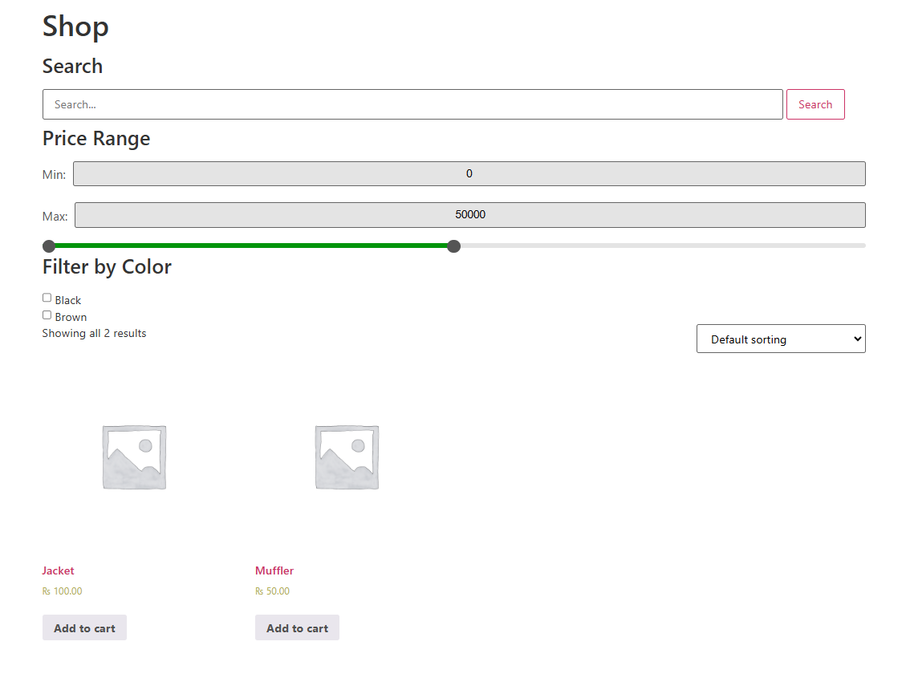

# iterel

A product filtering plugin.

## Functionalities

- Search by title
- Filter by price range
- Filter by product attributes
- Settings page to enable each functionality

## Usage

- Install the plugin(zip it and install or simple copy the plugin to plugins folder in your WordPress site)
- In the WordPress Admin, search for Iterel options page towards the bottom of the sidebar.
- Enable the product filter and other things you want to display in the shop page.
- Check if the product filter is working in the shop page.

## Demo 

